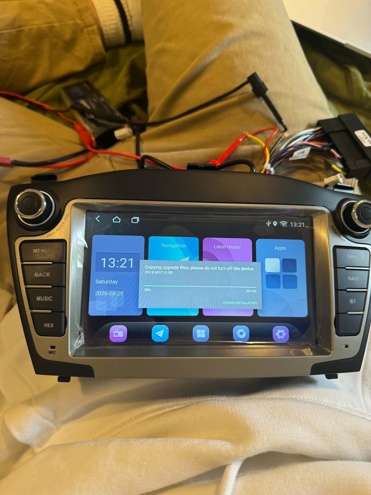
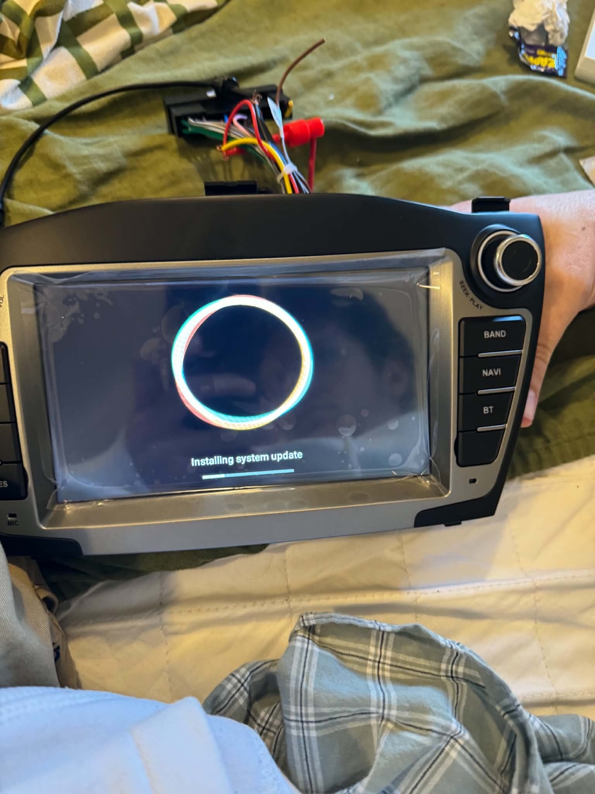
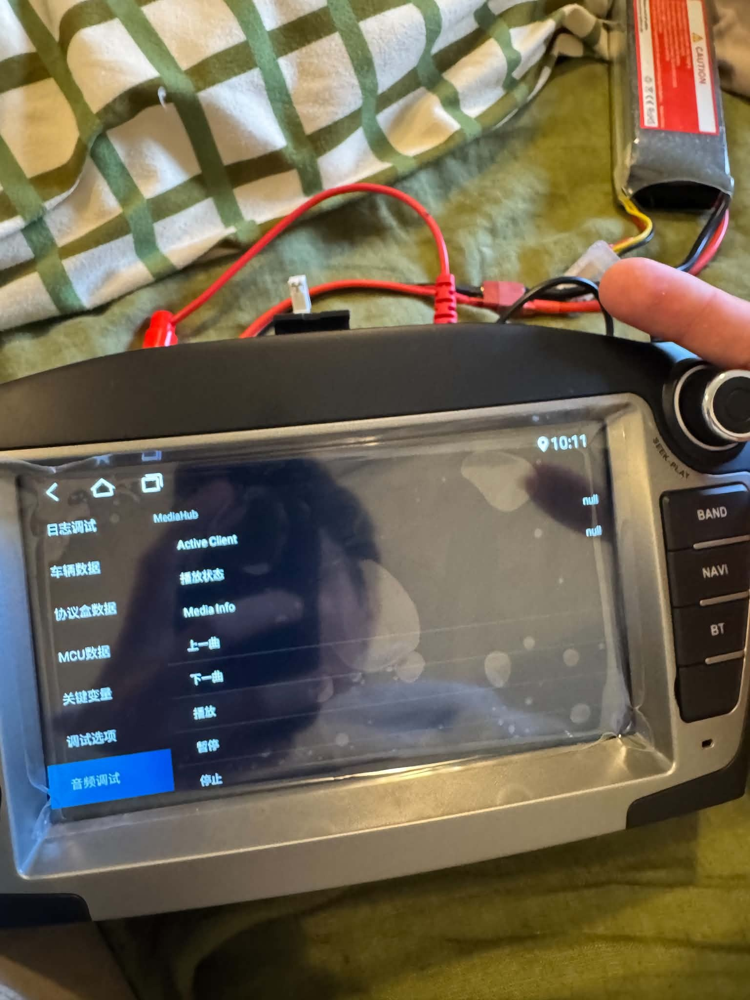
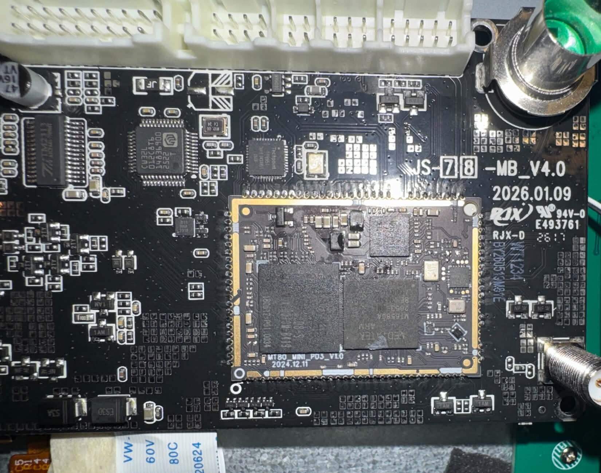
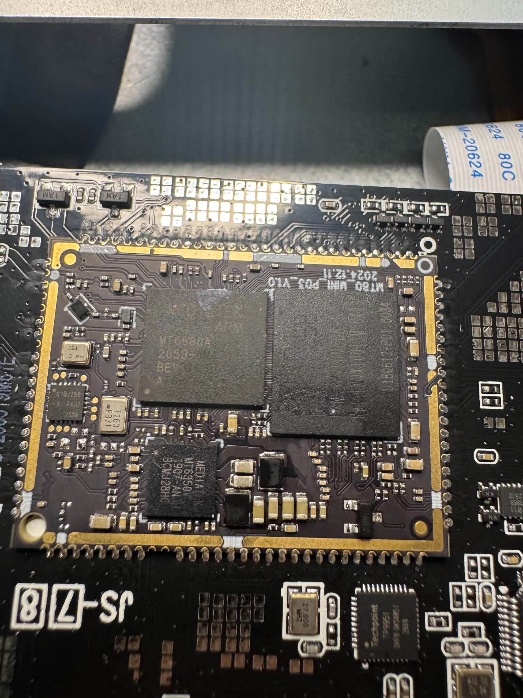

# (artistic approximation) Hyundai headunit

## JS7 V4 Mostly-Stock Platform Reference

 The technical archive below contains real unit photographs, captured partition artifacts and explicitly qualified hardware observations; it is not an official Hyundai firmware release.*

This repository contains partition-level reference artifacts and platform-identification data acquired from an operational **JS7 V4 Android head unit**. The acquisition state was **close to the supplied vendor configuration and predominantly stock**, but it was not a forensic image of an untouched factory device.

This is an independent technical archive. It is not an official release from the hardware manufacturer, seller, RegLink or Hyundai.

The repository also preserves a separate **Hyundai IX35 V4 skin**. That package is modified software and is not part of the mostly-stock backup.

*The physical JS7 V4 Hyundai ix35-format head unit used for partition acquisition, recovery analysis and controlled build testing.*

## Build summary

The target is a Chinese-market Hyundai ix35-format Android head unit based on the MediaTek `k80_bsp` board-support package. The acquired runtime reports Android 8.1.0/API 27, ARMv7 32-bit execution and RegLink vehicle integration on a 1024×600 display. Recovery validation, privileged ADB diagnostics and subsequent Hyundai customisation prevent this acquisition from being classified as an immutable factory baseline; the technically accurate description is **mostly-stock platform reference**.

Two related but separate items are preserved:

1. **Mostly-stock V4 reference:** acquired `recovery` and original `logo` partition images, Android property identifiers, partition-layout evidence and board-level component notes.
2. **Hyundai IX35 skin V1.2:** an exact-build-gated Android system customisation containing a launcher/dashboard, boot assets and selected identity/configuration changes. It is modified software with partial physical validation.

The earlier International V1 `system`/`custom` experiment is explicitly excluded. This repository is intended for platform identification, recovery research and rollback reference; it is not a universal ROM or complete flash-tool package.

## Acquisition scope and limitations

- Source device: operational physical V4 unit.
- Acquisition state: close to the supplied software configuration, with subsequent diagnostic and recovery activity.
- Known state variation: Android settings, package state, recovery history, ADB configuration and boot assets may differ from a newly supplied unit.
- Acquisition completeness: partial partition/reference set, not a sector-complete eMMC image.
- Restoration status: not validated as a complete flashable recovery set.
- Compatibility scope: restricted to matching hardware and software identifiers; “JS7 V4” branding alone is insufficient.

## Platform and hardware identification

| Item | Observed or reported value |
| --- | --- |
| Mainboard marking | `JS-78-MB_V4.0` (stylised PCB silkscreen) |
| Mainboard date marking | `2026.01.09` |
| CPU/daughterboard marking | `MT80_MINI_P03_V1.0` |
| CPU-module date marking | `2024.12.11` |
| Application processor marking | MediaTek `MT6580A` |
| Android-reported platform | MediaTek `MT6580` / MT6580 family |
| CPU architecture | ARMv7, 32-bit (`armeabi-v7a`) |
| Display target | 1024×600 |
| Memory observed | Approximately 1 GB RAM |
| Main filesystem type | EXT4 |
| MCU marking observed on the board | `CW32L052C8T6` |
| Video decoder noted | Techpoint `TP9951` |
| Audio IC family noted | `TM2313` family |
| Product name | `full_k80_bsp` |
| Device / board / model | `k80_bsp` |
| Android manufacturer property | `alps` |
| Recovery | Custom MediaTek/RegLink stock recovery |

PCB markings, dossier references and Android runtime properties are reported separately because these identifiers are not interchangeable. The captured runtime reports `MT6580`; a generic `UIS8581A` seller/platform label is not valid firmware-selection evidence for this unit.

The board identifiers above were transcribed from the supplied close-up photographs. The mainboard uses stylised boxed digits in the `JS-78` portion of the marking; compatibility checks should compare the photograph as well as the transcription.

## Software baseline

| Item | Captured value |
| --- | --- |
| Android version | Android 8.1.0 Oreo |
| Android API level | 27 |
| Build display ID | `CMDAZX80-U1_R8010_S6.14` |
| Build date recorded | 1 June 2026 |
| Build fingerprint | `alps/full_k80_bsp/k80_bsp:8.1.0/O11019/1676628720:user/release-keys` |
| RegLink all-in-one property | `ro.reglink.allinone=1` |
| Original Bluetooth-name property | `CarBt` |
| Local update application | RegLink system updater (`com.reglink.apps.ota`) |
| ADB state on captured unit | Root ADB access was available during collection |

Privileged ADB availability is an acquired-unit property and must not be generalised to other V4 units.

The hardware/software combination also integrates Wi-Fi, Bluetooth, GPS, USB, CarPlay/phone-link functions, physical front-panel controls and steering-wheel-control support. Vehicle, MCU, screen, touch, radio and amplifier configurations may differ between otherwise similar-looking units.

## Public reference artifacts

| File | Purpose | SHA-256 |
| --- | --- | --- |
| `recovery.img` | Recovery partition captured from the unit | `3477fc2623ef0f7d0755e51ffc71ca47ea864b878f7d9bfbaafbc529f16202ff` |
| `logo.img` | Original static-logo partition captured before the Hyundai customisation | `e76f413f2e4c9675e65f221e9f9b67a108fbe681843bd5bbba0bde596137a115` |

The unsanitised ADB acquisition contains device-unique and local-network identifiers and is deliberately excluded. Only privacy-reviewed derivatives may be published.

## Unavailable or excluded partitions

This archive does not currently contain a verified complete set of factory partitions. In particular, it does not provide a confirmed original set of:

- `preloader`, `lk` or `lk2`
- `boot`
- `system`
- `vendor`
- `custom`
- `nvram` or `nvdata`
- `protect1` or `protect2`
- `userdata`
- complete MCU firmware and vehicle-specific configuration

The earlier `SystemUpdate_JS7_REGLINK_2026_INTERNATIONAL_V1` files are experimental international-build material and are not part of this mostly-stock archive.

## Compatibility constraints

Do not perform partition writes based solely on JS7, V4, K80, MT6580 or UIS8581A branding. A compatibility assessment must compare at minimum:

1. Mainboard and CPU-board markings.
2. Android product, device, board and build identifiers.
3. Partition names, start addresses and sizes.
4. Display panel, resolution, orientation and touch-controller configuration.
5. MCU, radio, amplifier, Bluetooth, Wi-Fi, camera and vehicle-interface hardware.

Using an image from a superficially similar head unit can cause loss of display, touch, audio, radio, steering-wheel controls, camera functions, sleep/wake behaviour or boot capability.

## Acquisition and test photographs

| Local USB update from the stock-style launcher | RegLink/MediaTek system-update environment | Factory diagnostic screen |
| --- | --- | --- |
|  |  |  |

These photographs show the physical acquisition/test unit. Seller-advertisement images are excluded from the evidence set and are not used to substantiate hardware specifications.

### Board identification photographs

| V4 mainboard and CPU module | MT6580A CPU-module close-up |
| --- | --- |
|  |  |

The mainboard photograph was cropped to remove an unrelated support-number label. Both published files have had metadata and embedded profiles removed.

## Validation state

The repository is classified as a **mostly-stock V4 platform reference and rollback resource**. It is not an official update, complete firmware distribution or automated flashing package. A public full-restoration procedure remains out of scope until completeness, recovery-path reliability and hardware compatibility are independently validated on a matching unit.

## Hyundai IX35 skin

The separate [`hyundai-ix35-skin`](hyundai-ix35-skin/) folder contains the guarded V1.2 ADB customisation package for the exact captured V4 unit. It installs a Hyundai dashboard and boot appearance and changes selected Android identity, clock and ADB settings. It does not turn this archive into original firmware.

The skin is labelled **experimental / partially hardware-validated**. Read its warning and status notes before use.

## Related projects and technical references

The following independent projects cover adjacent MediaTek, Android-image or Chinese-head-unit work. They are listed for technical context and community recognition. They are **not dependencies**, and no code or firmware from them is represented as part of this archive unless explicitly stated elsewhere

## Provenance and licensing

This archive does not assert that the vendor partition images, bundled applications, boot media or vehicle marks are open-source. No open-source licence is granted for third-party binary content merely by its presence in this repository. The materials are preserved as an independent technical, interoperability and recovery reference; downstream publishers must determine whether their distribution is permitted in their jurisdiction.

Hyundai names and marks belong to their respective owner. This project is not affiliated with or endorsed by Hyundai, RegLink, MediaTek, the hardware manufacturer or the original seller. It is may own dreamlike interpretation lol

## Privacy and sanitisation

- The raw ADB dump is not included.
- Unit serial numbers, MAC addresses, personal Wi-Fi names and captured device IP addresses are not published.
- The real unit photographs have had metadata removed before publication; a support-number label was cropped from the board image.
- Seller-advertisement screenshots are excluded from the evidence gallery.
- The public skin is a separately hashed sanitised derivative that has no owner-specific default ADB target.
